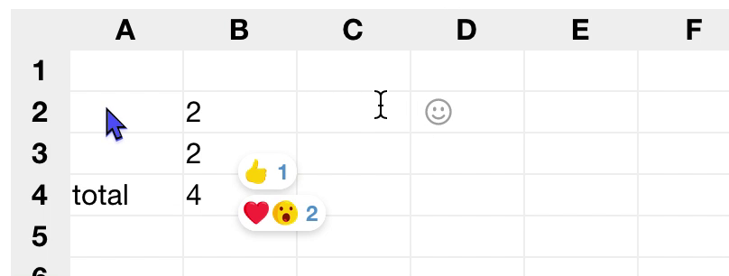

# spreadsheet

[](https://twitter.com/rsnous/status/1266855824577593344)

([video](https://twitter.com/rsnous/status/1266855824577593344))

i am [making a
spreadsheet.](https://twitter.com/rsnous/status/1262599431456567296)
you can use it online with multiple people and react to things. 

*note: I feel like programmers, when they want to make a real-time
collaborative application, always start with a text editor; that's
what we're used to spending all our time in*

*But making a collaborative text editor is really hard! [I honestly
think making a spreadsheet is a lot easier.](https://twitter.com/rsnous/status/1267321662522880002)*

## How it's made

All the important stuff is in the client, which is [one HTML
file](spreadsheet.html). (There is no front-end build system, there are
no other source code files, and there are no external libraries.)

The server is based on a Go WebSocket chat example and is
intentionally boring; it just relays messages ('cell was edited',
'mouse was moved', etc) from each client to all other clients. It has
no idea what a 'spreadsheet' is. I've been running it on my laptop.

## How to run

(I'm not hosting a public server right now)

```
$ make
```

then go to http://localhost:9391 --

## Notes to self

would be nice to have (cool):
- [audio/video call boxes in
  cells](https://twitter.com/rsnous/status/1260787644335656960)
  - or even asynchronous audio! like you push a key to talk, then when
    you let go, the thing you just said is an audio clip that lives in
    the cell
- show provenance of cell content somehow (who edited this cell last?)
  - persistent user identities?
- [conditional reactions? and/or cell history?](https://twitter.com/ommateum_io/status/1266870081956589568)
- AIM sign-on/off sounds
- meta-cells? e.g. a cell where you set your name that appears next to your
  pointer. I like the idea of using the spreadsheet itself to store
  all state etc
- better 'JS' 'APIs' that you can get to from cell formulas. timers,
  cell metadata, UI building, etc (maybe like Observable, you can
  output DOM?)
- a good name

would be nice to have (mundane):
- remap pointers into coordinate space and back so they communicate
  people's positions properly
  - or make everyone's views align pixel-perfectly
- make emoji reacts hang onto cells properly
- actually figure out good cell sizing behavior
- remove color-hash library
- clean/organize CSS crap out of JavaScript. maybe write a CSS syntax
  helper
- more keyboard shortcuts? arrow keys etc
- relative refs?
- ??? not sure -- (opt-in?) persistence? server (or a 'bot' client?)
  can replay events to new joiners? clients can import/export files
  themselves?
- ??? not sure -- lock cells other people are editing?

things I prefer not to do:
- obvious Google Docs-style persistence where each spreadsheet is
  a 'file' that lives at a random URL and you link people to it. i
  really like the synchronous quality that we have right now, where
  everyone has to be on at once. like old AIM chats
- restrict/sandbox the formula language down from the eval() it does
  right now. I don't care about security; if anything, I want to go
  the other way -- keep full JavaScript around and see what you can do
  w/ access to the whole page & spreadsheet application state
- make the server smarter. should make bots to do that stuff instead!
- run on some public server. I have no interest in securing the
  server, and I don't want to be responsible for people's documents
  - (and I don't want a deployment process to push changes from my
    laptop to this hypothetical server)
- have more than 1 source file

things I **definitely** **don't** want to do:
- any kind of build process. No TypeScript, no JSX, no webpack, no no
  no
- cross-origin dependencies: Firebase, Google Analytics, CDN
  libraries, etc
- use more libraries. especially servers that run in separate
  processes!!! (database, whatever) (at most, maybe I'd allow SQLite
  or something for persistence)

this project is a fun toy for experimenting with spreadsheet. it's not
meant to be useful for anything or anyone in particular. i will not
make changes to it that make it less fun :-)
